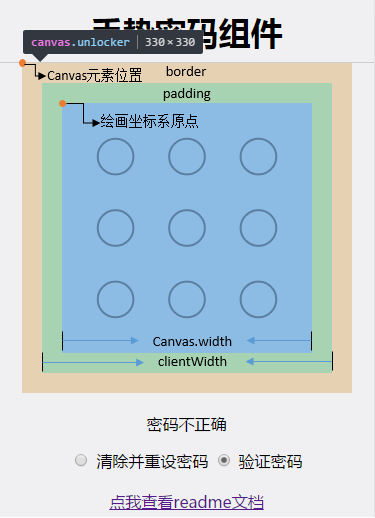

# GestureUnlocker 文档

一个H5的响应式手势密码组件

Demo展示地址：[http://sunriseteam.cn/h5/index.html](http://sunriseteam.cn/h5/index.html)


## 如何使用 ?

```html
<div class="canvas-container"></div>

<script src="./js/gestureUnlocker.js"></script>
<script>
var locker = new GestureUnlocker({
    sideLength: 300,			// 边长，canvas强制正方形
    circleColor: '#353031',		// 圆边的颜色 
    lineColor: 'rgb(255,165,0)', // 滑动时连线的颜色
    successColor: '#289c4a',	// 解锁成功时圆边颜色
    errorColor: 'red',			// 解锁错误时圆边颜色
    containner: ".canvas-container",	// canvas容器选择器
    className: 'unlocker',		// class名称,canvas元素样式定义
    callback: function (data) {  // 滑动结束后的回调函数
      	// 滑动的密码: data.code
      	console.log(data.code);
    }
});
</script>
```

### 参数详情

| 参数名          | 解释             | 类型              | 是否必须              |
| ------------ | -------------- | --------------- | ----------------- |
| sideLength   | 画布的边长          | Number          | 可选，默认值：`300`      |
| edge         | 边距             | Number          | 可选，必须大于`0`，默认`2`  |
| gap          | 间隔             | Number          | 可选，必须大于`0`，默认`2`  |
| circleColor  | 圆边的颜色          | String, 颜色值     | 可选，默认值：`#353031`  |
| lineColor    | 滑动时连线的颜色       | String, 颜色值     | 可选，默认值： `#ffa500` |
| successColor | 解锁成功时的圆边高亮颜色   | String, 颜色值     | 可选，默认值：`green`    |
| errorColor   | 解锁失败时的圆边高亮颜色   | String, 颜色值     | 可选，默认值：`red`      |
| containner   | canvas父容器的选择器  | String, 选择器     | 必须                |
| className    | canvas的类名，定义样式 | String, 类名      | 可选，默认无            |
| callback     | 画线结束后的回调函数     | function (data) | 必须                |
| mode         |                |                 |                   |

### 方法详情

#### drawCode(isSuccess, clearTime)

**描述**： 函数用于滑动结束时，将用户滑动的密码的高亮显示，高亮部位为密码所选中圆的圆边，成功时，圆边颜色为参数中定义的`successColor`，失败时为`errorColor`

**参数**：

* isSuccess： 布尔值，传入`true`表示解锁成功，高亮颜色值为参数中`successColor`，否则`errorColor`，默认值`false`
* clearTime： 整型值，单位`ms`，表示多少秒后清除上次动作，恢复界面，默认值`300`

#### clear()

**描述**： 清除上次解锁动作，恢复界面

## 画布宽度自适应特性

可以通过定义`className`来实现画布宽度更具设备宽度自适应：

* `class`中以百分比形式设置`width`


* 若`class`中重新定义了画布`width`值，则会覆盖`sideLength`值，即class中`width`优先级高
* `class`中可以设置`padding`和`border`，不影响画布的宽度计算

### 自适应Demo

```html
// css
<style>
.unlocker {
  width: 100%;
}
</style>

// javascript
<script>
var locker = new GestureUnlocker({
    sideLength: 300,	// class重新定义了宽度，此项设置被覆盖无效
    containner: ".canvas-container",
    className: 'unlocker',
    callback: function (data) {
    }
});
</script>
```

## 代码实现思路

使用HTML的canvas去实现操作的动画以及解锁的圆圈，监听在canvas元素上的touch事件，进行不同的响应

* `touchstart`事件：当触摸开始的点位于圆圈内，开始记录滑动轨迹
* `touchmove`事件：根据滑动的坐标不断刷新画布，更新轨迹
* `touchend`事件：重置界面，调用回调函数返回本次滑动的密码

实现过程中需要考虑两个细节：

* 用户触摸的坐标转换为`canvas`中绘画的坐标
* 自适应特性

**坐标转换：**

1. 使用`getBoundingClientRect()`获取`canvas`在文档中的坐标，即下图中标记的**canvas元素位置**
2. 根据元素位置减掉`border`和`padding`的宽度，得到绘画坐标系的原点坐标
3. 用`Event`中的坐标减去绘画原点坐标，就是`canvas`中API需要传入的坐标了

> 相对绘画原点坐标 = `Event`坐标 - `canvas`元素的坐标 - `padding` - `border`



**自适应特性：**

使用`class`去设置`canvas`元素盒子模型的宽度后，代码将重新计算`canvas.width`覆盖参数中的`sideLength`值，原理如下：

> canvas.width = clientWidth - padding-left - padding-right 

组合上媒体查询Media Query的特性，根据不同宽度的设备设置`width`值，这样就实现了动态的设置`canvas`的大小